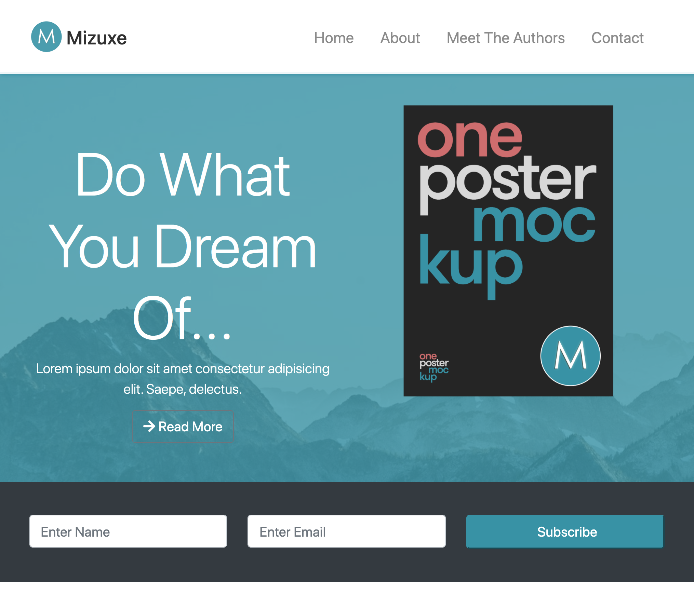
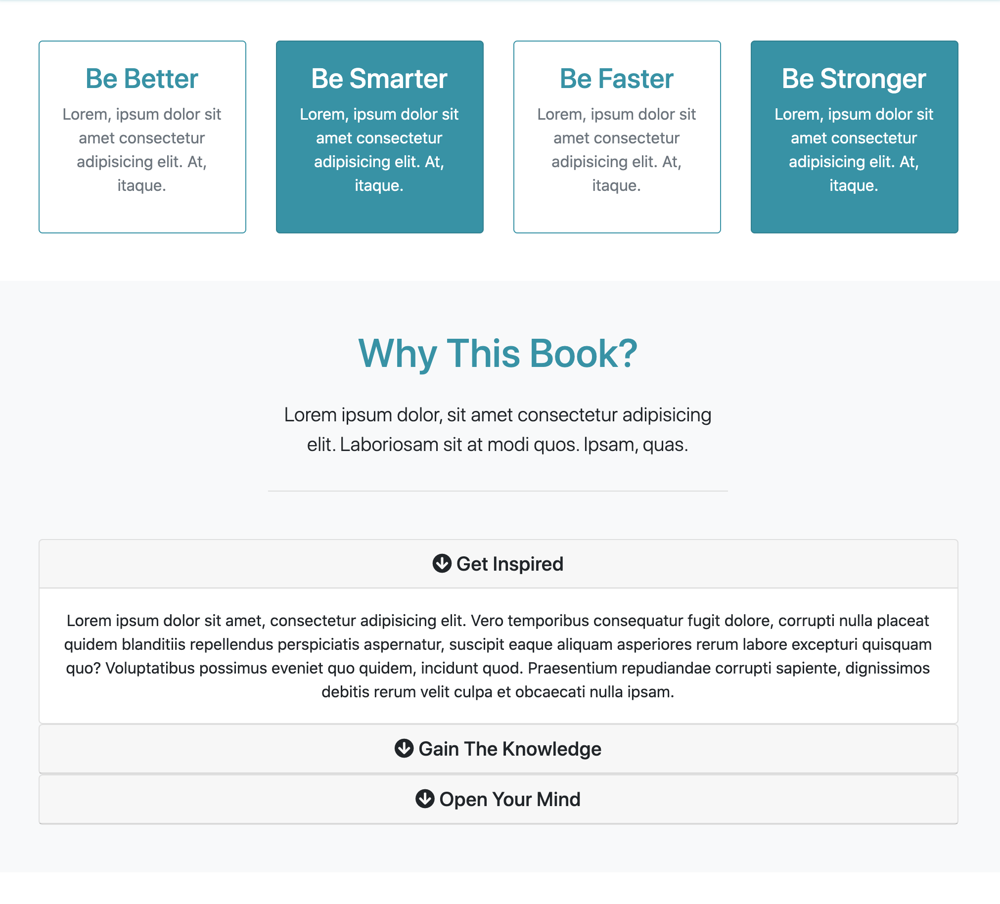
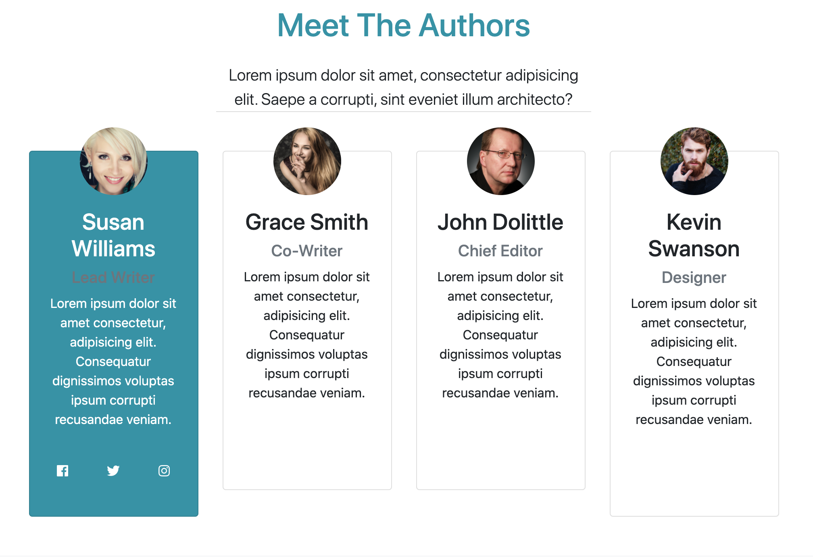
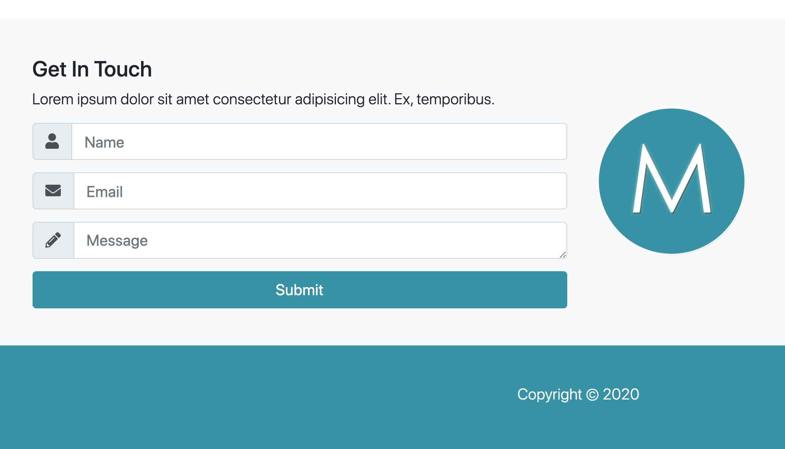

# Mizuxe - User interface built with Bootstrap

This user interface is built with Bootstrap. It is fully responsive and uses scrollspy and smooth scrolling to control the links in the navbar. Accordion

# Screenshots

Home section

About section

Authors section

Contact and Footer sections

## Author

- Albert Stjärne (https://github.com/AlbertStjarne)
